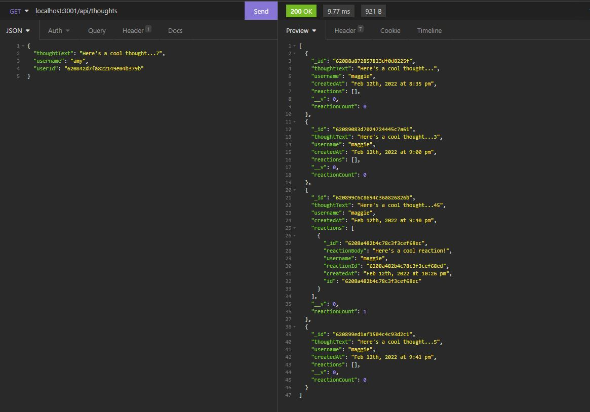

# Social_Network_API

This API helps user to handle large amounts of unstructured data. The database is handle in Insomnia. User would be able to add, update, and delete data. User can also create, update and delete relationship between data as well. 

#### The app looks like the following

## Demo
[Demo Video Part 1](https://watch.screencastify.com/v/13sMK65qaYoRgjgEbPhI)

[Demo Video part 2](https://watch.screencastify.com/v/1e9S0kN1JEe0LzvKKR5h)

## Tech used
* Express
* Mongoose

## License
Licensed under the MIT license.
